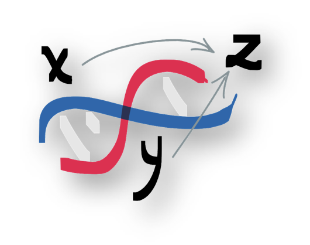

<p align="center">
  
  <h1 align="center">Welcome!</a></h1>
</p>

This GitHub page contains projects related to my research, as well as some older projects that I have archived for reference.

[](https://www.normalesup.org/~tuyeras/)
[](https://twitter.com/rtuyeras?lang=en)
[
](https://hub.docker.com/u/rtuyeras)


[](https://github.com/anuraghazra/github-readme-stats)

<br>

<p align="center">
  <h1 align="center">What I currently work on</h1>
</p>

I strongly believe that the future of genomics will depend on our ability to go beyond traditional approaches and adopt a more holistic view of complex problems. 
Current challenges include the **privacy of genomic data** and the lack of flexible tools for studying **complex genetic effects**. To address these challenges, I have developed several Python libraries that allow researchers to simulate realistic variant call data and study complex genetic effects using novel analytical techniques from post-modern algebra.

<br>

<p align="center">
  
  <h2 align="center"><a href="https://github.com/remytuyeras/HaploDynamics">HaploDynamics</a></h2>
</p>


This is a cloud-native software framework for fast generation of genomic data simulations. One of the features I am currently working on is to make this project composable with the user's models for specific mutation profiles or genetic positioning. 

$$\begin{array}{ccccccc}
\mathsf{User}&&\mathop{\longrightarrow}\limits^{\fbox{1}}&&(x_{1},x_{2},\dots,x_{n})&&\\
^{\fbox{2}}\downarrow&&&&\downarrow&&\\
(x_{1},x_{2},\dots,x_{n}) &\longrightarrow& \fbox{$\mathsf{UserModel}$} &\longrightarrow& \fbox{$\mathsf{HaploDXModel}$}& \longrightarrow &\fbox{$\mathsf{VCFData}$}\\
\end{array}$$

So far, users have control on:
  1. population-specific LD decay profiles
  2. bottleneck parameters
  3. allele frequency spectra (and/or mutation rate profiles)
  4. LD block lengths
  5. genetic position values

In the near future, the ```HaploDynamics.Framework``` module will include an arithmetic to manipulate the generated VCF files (or in fact any VCF file).

<br>

<p align="center">
  
  <h2 align="center"><a href="https://github.com/remytuyeras/pedigrad-library">Pedigrad Library</a></h2>
</p>


I have been working on this software for the last five years to fully implement the framework developed in <a href="https://arxiv.org/abs/1708.05255">CTG</a>, <a href="https://arxiv.org/abs/1805.07002">CTGI</a> \& <a href="https://arxiv.org/abs/1805.07004">CTGII</a> . I intend to publish a new version of this framework **soon**, inclduing new semigroup-based linear algebra features to find combinatorial genetic effects from variant call and phenotype data. Overall,  the ```Pedigrad``` library will provide a new paradigm for doing machine learning on genomic data and learn combinatorial relationships.

$$\begin{array}{c|c|c|c}
\textbf{A pedigrad} & \textbf{A segment} & \to & \textbf{A semigroup of haplotypes}\\
\hline
\textit{the framework provided} & \textit{where learning events occur} & \to & \textit{where algebraic operations are used}\\
\textit{by the library} & \textit{to find genetic interactions} & \to & \textit{to guide the learning}\\
\hline
&&&\\
P:&(\bullet\bullet\dots\bullet\bullet)\dots(\bullet\bullet\dots\bullet\bullet) & \mapsto & \lbrace\sum_i x_i = \sum_i y_i~|~x_i,y_i\textrm{ haplotypes}\rbrace\\
&&&\\
\end{array}$$

On the long term, the ```Pedigrad``` library will also be used to complete the simulations of the ```HaploDynamics``` library with complex genomic architecture generations (e.g. variant interactions, complex phenotypes, environment modeling etc.).

<br>

<p align="center">
  
  <h2 align="center"><a href="https://github.com/remytuyeras/aces">ACES (FHE scheme)</a>a></h2>
</p>

This project constains the code developed for a paper detailing the design of a fully homomorphic encryption scheme. The outcomes of this work bear significance in the domains of machine learning and privacy computing.


