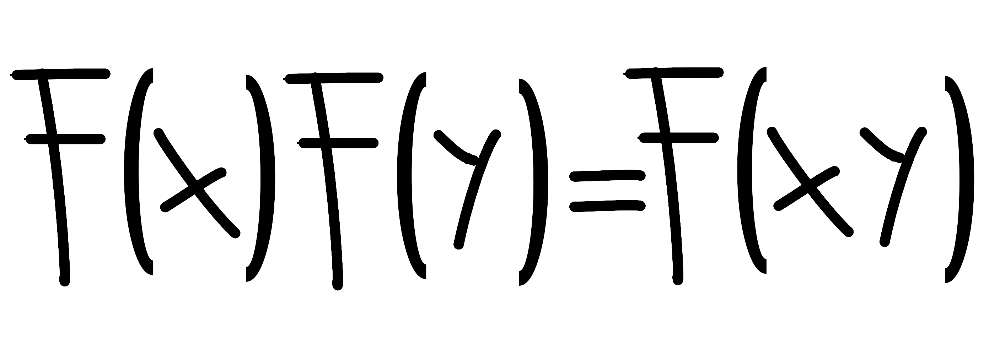

  
  <h1 align="center">Welcome!</a></h1>

This GitHub page contains projects related to my research, as well as some older projects that I have archived for reference.

 

<!-- 

  <h1 align="center">What I'm Currently Working On</h1>

I am currently focused full-time on the development of **PyACES**, a fully homomorphic encryption (FHE) scheme. In the future, I plan to use this scheme for implementing **secure machine learning models**, particularly in **natural language processing (NLP)**.  

As the project evolves, I plan to join **GitHub Sponsors** to allow those who find value in this work to support its continued development. If you’re interested in **advancing FHE research and its applications**, your future support, whether through sponsorships, contributions, or discussions, would be greatly appreciated! :rocket: -->

  <h1 align="center">What I'm Currently Working On</h1>

I am currently focused full-time on the development of **PyACES**, a fully homomorphic encryption (FHE) scheme. In the future, I plan to use this scheme for implementing **secure machine learning models**, particularly in **natural language processing (NLP)**.  

Alongside this, I am developing **Intuitionistic Language Models (ILM)**, a toolkit for language models based on **hierarchical tokenization**. ILM offers a structured alternative to standard tokenization by organizing tokens into multiple levels.

As these projects evolve, I plan to join **GitHub Sponsors** to allow those who find value in this work to support its continued development. If you're interested in **advancing research in homomorphic encryption, structured language models, or privacy-preserving machine learning**, your future support, whether through sponsorships, contributions, or discussions, would be greatly appreciated! :rocket:

 

  
  

  

<!-- 

  
  <h2 align="center"><a href="https://github.com/remytuyeras/aces">ACES (FHE Scheme)</a></h2>

 -->

[)](https://github.com/remytuyeras/aces/tree/main)
[)](https://github.com/remytuyeras/aces/tree/dev)

This repository contains the **Python implementation of ACES**, a fully homomorphic encryption scheme introduced in the research paper [_"Constructing a Fully Homomorphic Encryption Scheme with the Yoneda Lemma"_](https://arxiv.org/abs/2401.13255).

I am actively working on a **developer guide** for the new codebase (see the [`dev`](https://github.com/remytuyeras/aces/tree/dev) branch).  

Looking ahead, I aim to introduce the following enhancements _(subject to funding or sponsorship)_:

### :rocket: **Planned enhancements**
- [ ] :file_folder: Develop a function for generating cryptographic data with an **efficient locator-director database (RAM)**.  

- [ ] :floppy_disk: Enable **local storage of cryptographic data (ROM)** and implement **secure key management**.  

- [ ] :lock: Implement **file encryption (ROM)**.  

- [ ] :abacus: Support **complex data types** (`Int8`, `Int16`, `Int32`, `String`, `Bool`) and their arithmetic operations.  

- [ ] :zap: Optimize for **CPU & GPU performance**:  

  - [ ] :gear: Utilize **C, C++, or `ctypes`** for **efficient polynomial and ciphertext operations**.  
  
  - [ ] :video_game: Implement **GPU acceleration using CUDA**.  

  

**Intuitionistic Language Models (ILM)** is a toolkit for structured language models using hierarchical tokenization. Instead of large predefined vocabularies, ILM organizes tokens into multiple levels, capturing both local and global patterns.

Inspired by biological encoding principles, ILM represents language with a structured set of 64 base tokens, akin to DNA's 64 codons. By reducing reliance on memorized mappings and emphasizing hierarchy, ILM provides a foundation for more interpretable and efficient language models.

### :star: **Current focus**
- [ ] Developing a **hierarchical tokenizer** that structures words into multi-level representations.

- [ ] Providing a **lightweight and flexible** alternative to existing tokenization libraries.

- [ ] Exploring applications in **language model training and structured learning**.

### :rocket: **Future goals**
- [ ] Expanding ILM into a **complete language model toolkit** with tools for **training, evaluating, and deploying models**.

- [ ] Refining the **hierarchical tokenization approach** to improve efficiency and interpretability.

- [ ] Investigating **theoretical foundations and potential applications** in structured NLP models.
