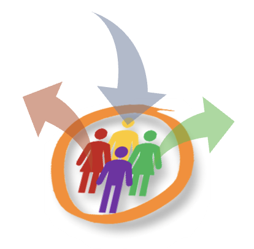

<p align="center">
  
  <h1 align="center">Hello there!</a></h1>
  <p align="center">On this Github page you will find projects related to my research as well as some very old school projects that I put here for storage purposes.</p>
</p>

<p align="center">
  <h1 align="center">What I currently work on</h1>
</p>
I strongly believe that the future of genomics will depend on our ability to go beyond traditional approaches and adopt a more holistic view of complex problems. 
Current challenges include the **privacy of genomic data** and the lack of flexible tools for studying **complex genetic effects**. To address these challenges, I have developed several Python libraries that allow researchers to simulate realistic variant call data and study complex genetic effects using novel analytical techniques from post-modern algebra.

<p align="center">
  
  <h2 align="center"><a href="https://github.com/remytuyeras/HaploDynamics">HaploDynamics</a></h2>
</p>
This is a cloud-native software framework for fast generation of genomic data simulations. One of the features I am currently working on is to make this project composable with the user's models for specific mutation profiles or genetic positioning. 

$$\begin{array}{ccccccc}
\mathsf{User}&&\mathop{\longrightarrow}\limits^{\fbox{1}}&&(x_{1},x_{2},\dots,x_{n})&&\\
^{\fbox{2}}\downarrow&&&&\downarrow&&\\
(x_{1},x_{2},\dots,x_{n}) &\longrightarrow& \fbox{$\mathsf{UserModel}$} &\longrightarrow& \fbox{$\mathsf{HaploDXModel}$}& \longrightarrow &\fbox{$\mathsf{VCFData}$}\\
\end{array}$$

So far, users have control on:
- mutation rates
- lengths of LD blocks
- genetic position values

<p align="center">
  
  <h2 align="center"><a href="https://github.com/remytuyeras/pedigrad-library">Pedigrad Library</a></h2>
</p>
This is a software I have been working on for the last five years. I intend to publish a new version soon, with some semigroup linear algebra features that you can use to find combinatorial genetic effects from variant call and phenotype data. On the long term, the ```Pedigrad``` library will complete the simulations of the ```HaploDynamics``` library with phenotype simulations.

<p align="center">
  <h2 align="center">Homomorphic encryption</h2>
</p>
I intend to add a project on a new model for Homomorphic Encryption. More to come later this year.


